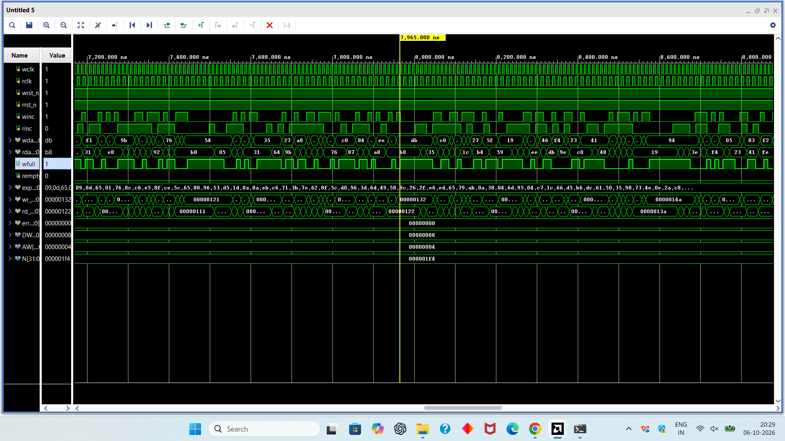
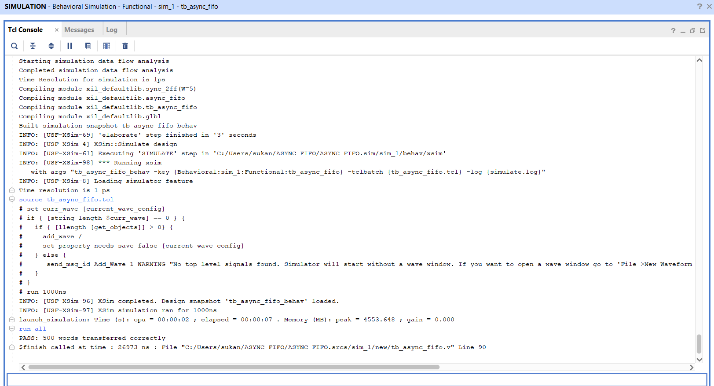

# async-fifo-verilog
Asynchronous FIFO with Gray-code pointers and self-checking testbench (Verilog)

## Features
- Separate write clock (`wclk`) and read clock (`rclk`)
- Parameterized data width (`DW`) and address width (`AW`); default: 8-bit data, depth 16
- (N+1)-bit binary pointers, converted to Gray code before crossing domains
- 2-flop synchronizers for pointer crossing
- `wfull` generated in the write domain, `rempty` in the read domain
- Asynchronous active-low reset on both sides

## How it works
1. Each side keeps a binary pointer (to address memory) and a Gray-code pointer (to send to the other side).
2. Gray code changes only 1 bit per increment, so a synchronizer cannot capture a wildly wrong value.
3. The Gray write pointer is synchronized into the read clock domain, and the Gray read pointer into the write clock domain.
4. **Empty**: read Gray pointer equals synchronized write Gray pointer.
5. **Full**: next write Gray pointer equals synchronized read Gray pointer with the top 2 bits inverted.
6. Synchronized pointers may be slightly old, which only makes the FIFO look more full or more empty, never less. So the design is safe.

## Folder structure
```
async-fifo-verilog/
├── rtl/   async_fifo.v
├── tb/    tb_async_fifo.v
└── docs/  waveform and simulation screenshots
```

## Verification
- Self-checking testbench with write and read clocks of different frequencies
- 500 random data words written with random gaps, read back with random gaps
- Every read word is compared with the expected word; the result is printed as PASS or FAIL
- FIFO reached the full condition during the test (see waveform below)

**Result:** `PASS: 500 words transferred correctly`, 0 errors.

### Waveform (full condition)


### Simulation result


## Tools
- Vivado 2025.2 (behavioral simulation)

## How to run
1. Create a Vivado RTL project.
2. Add `rtl/async_fifo.v` as a design source.
3. Add `tb/tb_async_fifo.v` as a simulation source and set it as top.
4. Run Behavioral Simulation, then type `run all` in the Tcl console.

## Future work
- Synthesis and timing results on Artix-7
- SystemVerilog assertions and functional coverage
- CDC checks with a CDC tool
